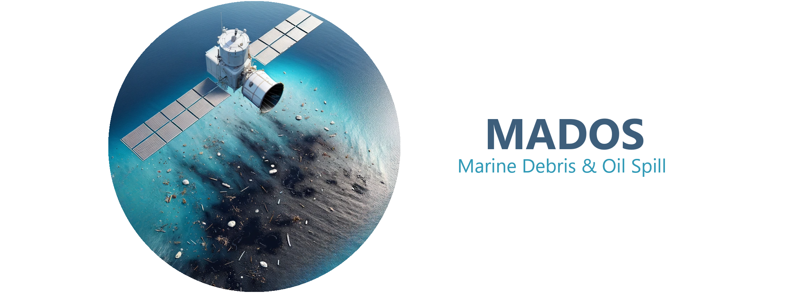

[[`paper`](https://www.sciencedirect.com/science/article/pii/S0924271624000625)][[`project page`](https://marine-pollution.github.io/)][[`dataset`](https://zenodo.org/records/10664073)]

Marine Debris and Oil Spill (MADOS) is a marine pollution dataset based on Sentinel-2 remote sensing data, focusing on marine litter and oil spills. Other sea surface features that coexist with or have been suggested to be spectrally similar to them have also been considered. MADOS formulates a challenging semantic segmentation task using sparse annotations.

 In order to download MADOS go to https://doi.org/10.5281/zenodo.10664073.
 
 ## Installation
 
 ```bash
conda create -n mados python=3.8.12

conda activate mados

conda install -c conda-forge gdal==3.3.2

pip install -r requirements.txt --extra-index-url https://download.pytorch.org/whl/cu113 -f https://download.openmmlab.com/mmcv/dist/cu113/torch1.11/index.html

conda install pytables==3.7.0
```

 ## Evaluate MariNeXt

To evaluate MariNeXt, place the MADOS dataset under the `data` folder, download the pretrained models (5 different runs) from [here](https://drive.google.com/drive/folders/1VwkFp47TEvRVXHNbucBmmylfZwIUmCWx?usp=drive_link) and place them under the `marinext/trained_models` folder and then run the following:

```bash
python marinext/evaluation.py --path ./data/MADOS --model_path marinext/trained_models/1
```

 ## Train MariNeXt

To train MariNeXt from scratch, run the following:


```bash
python marinext/train.py --path ./data/MADOS
```

 ## Stack Patches

To stack the image patches to form multispectral images, run the following:


```bash
python utils/stack_patches.py --path ./data/MADOS
```

 ## Spectral Signatures Extraction
To extract the spectal signatures of MADOS dataset (after stacking) and store them in a HDF5 Table file (DataFrame-like) run the following:

```bash
python utils/spectral_extraction.py --path ./data/MADOS_nearest
```

Alternatively, you can download the `dataset.h5` file from [here](https://drive.google.com/file/d/1BUIxcm1SLU9sqr8NE2FKJvJJPv2RLyk-/view?usp=sharing).

To load the `dataset.h5`, run in a python cell the following:

```python
import pandas as pd

hdf = pd.HDFStore('./data/dataset.h5', mode = 'r')

df_train = hdf.select('Train')
df_val = hdf.select('Validation')
df_test = hdf.select('Test')

hdf.close()
```


 ## Acknowledgment

This implementation is mainly based on [MARIDA](https://github.com/marine-debris/marine-debris.github.io), [SegNeXt](https://github.com/Visual-Attention-Network/SegNeXt), [mmsegmentaion](https://github.com/open-mmlab/mmsegmentation/tree/v0.24.1), [Segformer](https://github.com/NVlabs/SegFormer) and [Enjoy-Hamburger](https://github.com/Gsunshine/Enjoy-Hamburger).


If you find this repository useful, please consider giving a star :star: and citation:
 > Kikaki K., Kakogeorgiou I., Hoteit I., Karantzalos K. Detecting Marine Pollutants and Sea Surface Features with Deep Learning in Sentinel-2 Imagery. ISPRS Journal of Photogrammetry and Remote Sensing, 2024.
 
